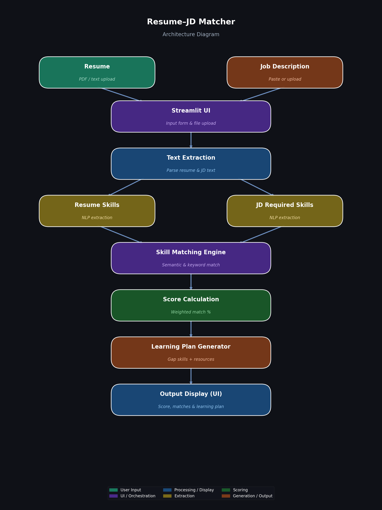

# Skill Forge – AI Skill Gap Analyzer

## Overview

Skill Forge is an AI-powered system that analyzes job descriptions and resumes to identify skill gaps and generate personalized learning plans.

It helps job seekers understand what skills they need to improve for specific roles.

---

## Features

* Resume input (Paste / Upload)
* Upload support (TXT)
* Smart skill extraction
* Skill matching and scoring
* Personalized learning roadmap
* Clean and interactive UI (Streamlit)

---

## Tech Stack

* Python
* Streamlit

---

## Supported File Types

* TXT

---

## Note

PDF and image support are limited in cloud deployment to ensure stability.

---

## Architecture

The system follows this pipeline:

User Input → Skill Extraction → Skill Matching → Gap Analysis → Learning Plan → UI Output

### Architecture Diagram

---

## Scoring Logic

The system calculates a match score based on the overlap between required skills and candidate skills.

1. Skills are extracted from the job description and resume using keyword matching.
2. Matching skills are identified by comparing both lists.
3. Missing skills are computed as skills present in the job description but absent in the resume.

The match score is calculated as:

Match Score = (Number of Matched Skills / Number of Required Skills) × 100

This provides a simple and interpretable measure of how well a candidate aligns with a given job role.

---

## Sample Input and Output

### Input

Job Description:
Data Analyst with Python, SQL, Excel

Resume:
Experienced in Excel dashboards and basic Python scripting

---

### Output

Required Skills:
- Python
- SQL
- Excel

Candidate Skills:
- Python
- Excel

Missing Skills:
- SQL

Match Score:
66%

Learning Plan:
- SQL:
  - Time Estimate: 2–3 weeks
  - Resources: YouTube tutorials and practice problems
  - Suggested Practice: Write basic queries, filtering, joins

---

## Live Application

https://skill-forge-ai-mk8pj7a5hjzazfbyx27hp3.streamlit.app/

---

## Demo Video

https://drive.google.com/file/d/1rou6548kYvHMPJUbG8g2EUyONX4KfFVo/view?usp=sharing

---

## How to Run Locally

pip install -r requirements.txt
streamlit run app.py

---

## Use Case

This system helps students and job seekers identify missing skills and build a structured learning path to achieve their career goals.
